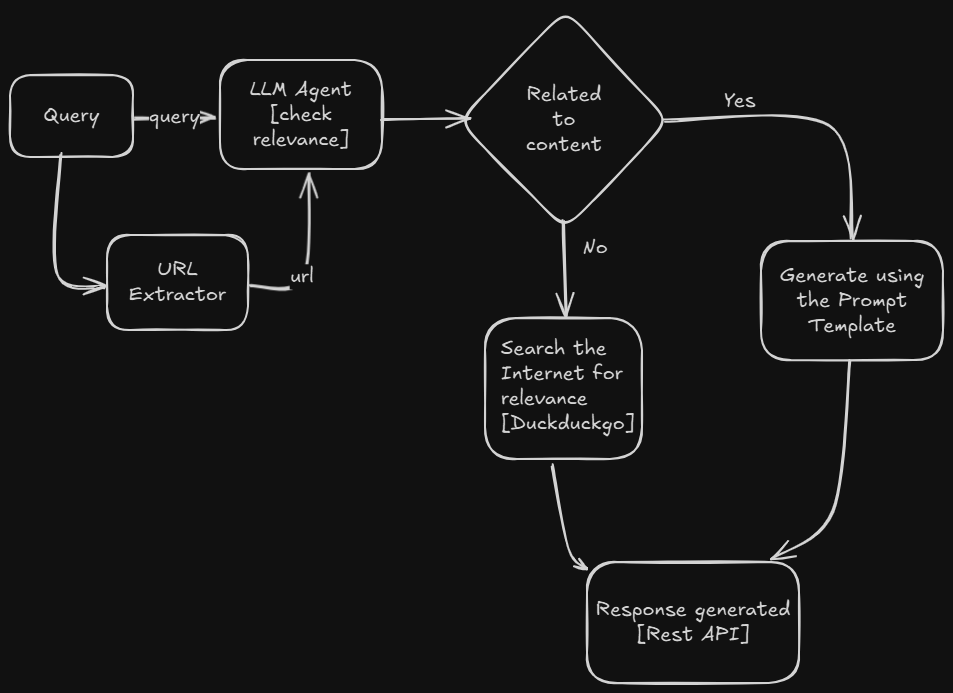

## Quick Links
* [ Talk to page](#talk-to-page)
* [Getting Started](#getting-started)
* [Flowchart](#flowchart)
* [Screen Recording](#screen-recording)
* [Features](#features)
* [Contributing](#contributing)

## Talk to page

- This project let you chat with a given url particularly research paper links. 
- The poject aims to use the advancements of LLM while using the web pages as the context.
- With advance RAG (Retrieval Augument techniques) we can chat with the web pages and get the most relevant information. 

## Getting Started

> [!IMPORTANT]
> in the `.env`, file make sure to put with your own `Huggingface API token` enable with Inference.

- Clone the repository from github.
- cd talkl_to_page

> [!TIP] 
> Using Makefile

- RUN `make start` to start the agent for the first time
- RUN `make run` to restart the agent
- Project will be available at http://localhost:8501

> [!TIP] 
> Using Doker

- `docker build -t talk-to-page:latest -f Dockerfile .`
- `docker run -p 8501:8501 talk-to-page:latest`
- Project will be available at http://localhost:8501

> [!TIP]
> Using pip

- pip install .
- CMD `start`
-Project will be available at http://localhost:8501

## Flowchart

> [!NOTE]
> Searching the internet component is not release!! Please contact the developer for more information.

## Screen Recording
<video controls src="media/record_talk_to_url.mp4" title="Title"></video>

## Features
- Chat with web pages
- Get the most relevant information
- Use the web pages as the context
- Use the advancements of LLM
- In the Query provide a url, [there is no need of a specific format]

## Contributing

- Fork the repository
- Create a new branch

> [!NOTE]
> The project will use Haystack and webui to chat with the web pages and get the most relevant information.

> [!TIP]
> The project development is pause * [ ].

> [!NOTE]
> The project is open source and free to use.
> The project is a mid level RAG based AI Agent, which can be used to chat with web pages and get the most relevant information.
> For more advanced RAG based AI Agent, please contact the developer.
